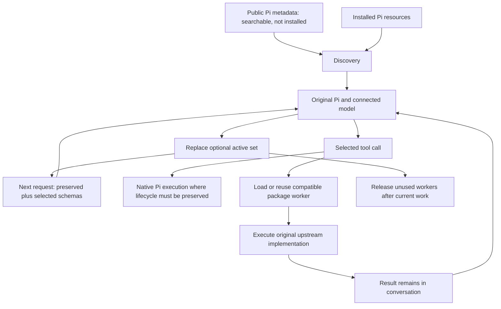
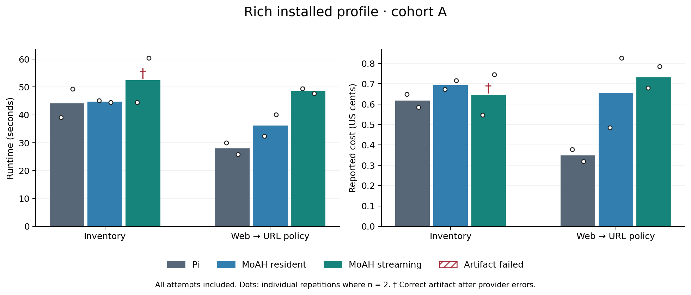
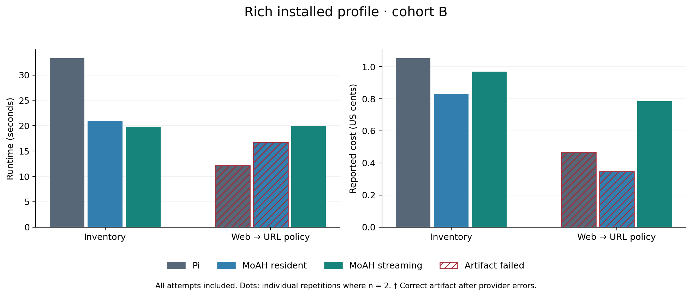
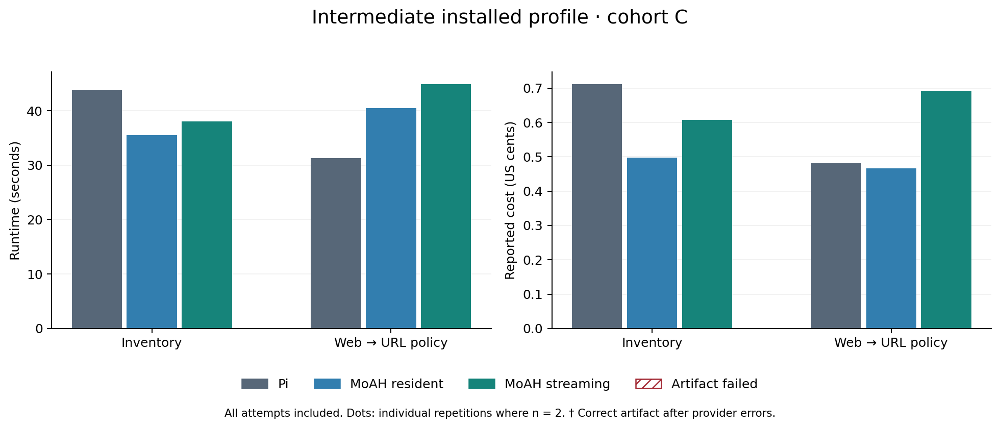
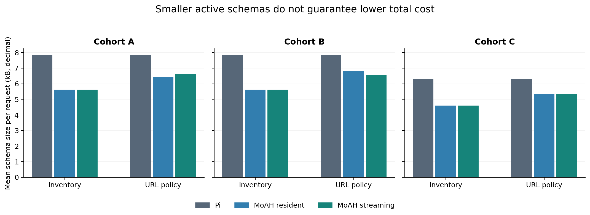
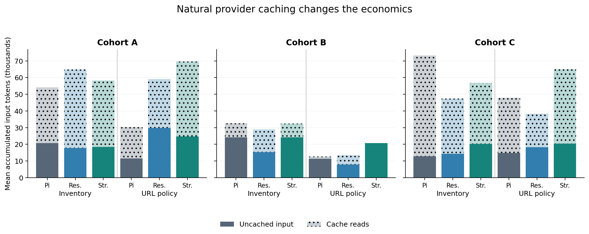
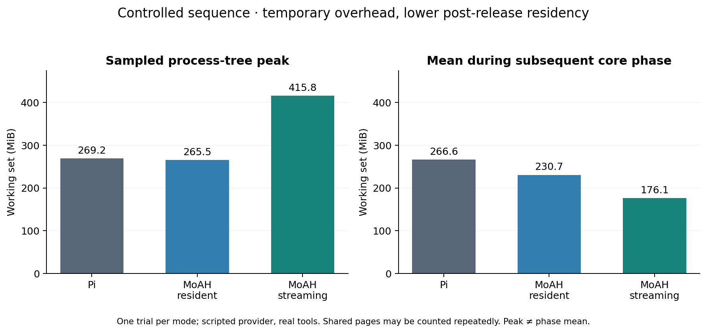

# MoAH: Mixture of Agent Harness
## Phase-adaptive capability selection and demand-loaded tool execution on Pi

**Technical report · v0.1.0 research preview · 15 September 2026**  
MoAH contributors  
[Implementation](https://github.com/francescoopiccolo/MoAH) · [Data](data/README.md) · [Reproduction](REPRODUCING.md)

## Abstract

Minimal coding-agent harnesses such as Pi offer a small default tool surface and
an extensible environment. Broadening that environment, however, can require
developers to understand available extensions and decide what to install,
enable, retain or remove for a task. We propose **MoAH, Mixture of Agent Harness**:
retain a minimal active interface while delegating phase-specific capability
selection to the agent's existing model. The intended benefit is access to a
broad tool ecosystem without requiring the developer to perform that selection
manually for every phase. Our prototype implements compact discovery,
replacement of the active optional-tool set, and demand loading and release of
compatible tool-package processes on original Pi. It does not yet automate
arbitrary package installation/uninstallation or establish reduced human effort.

We separate context selection from process residency through native Pi, resident
MoAH and streaming MoAH conditions. A complete public-index capture contains
5,513 package records, while executed profiles expose six or nine native Pi
tools. Across 24 exploratory real-model attempts, 22 produce correct artifacts
and 21 satisfy a stricter error-free criterion. Smaller active schemas do not
consistently reduce runtime or cost: extra control calls, agent behavior and
provider caching often offset them. In a separate controlled sequence, streaming
reduces the subsequent core-phase mean process-tree working set by 33.9% relative
to Pi, while increasing the sampled peak by 54.5%. These results support a
conditional opportunity for phase-dependent context and residency management,
not a universal advantage over Pi or other harnesses. Physical SSD efficiency,
large installed-tool scaling and developer-effort savings remain unmeasured.

**Keywords:** coding agents; tool discovery; active context; extension lifecycle;
Pi; demand loading; process residency; agent evaluation.

## 1. Motivation and research question

An extensible coding agent faces two different capacity problems. The ecosystem
may contain many potentially useful capabilities, while a particular model
request needs only a few detailed tool definitions. Separately, the local
runtime may retain code and dependencies for capabilities that are no longer
needed. Increasing ecosystem coverage need not require maximizing both the
model's current interface and the runtime's resident processes.

Pi is an appropriate foundation because its small default tool set and extension
APIs make those choices explicit. Its minimalism is intentional; describing it
as an incomplete or incapable harness would misrepresent the design. MoAH's
question is whether an agent can inherit that small-interface advantage while
taking over more of the task-specific capability selection. This is a question
about who performs selection and when resources are released, not about replacing
Pi's established agent loop. [1, 2]

The motivating workflow includes discovery, reading extension documentation,
choosing packages, installation, configuration, runtime execution and later
maintenance. A developer may progressively customize Pi instead of choosing
between two artificial extremes, “bare Pi” and “everything installed.” Our
evaluation therefore includes an intermediate installed profile. It does not
equate a command's wall time with a developer's thought process.

We investigate four hypotheses:

1. A compact catalog plus phase-specific activation can reduce detailed tool
   schemas while preserving access to configured capabilities.
2. Releasing compatible workers after a phase can lower subsequent residency,
   even when loading them increases transient memory and latency.
3. Those savings can survive real agent choices and provider caching in some
   workloads; their net effect must be measured rather than inferred.
4. Delegating selection can reduce human discovery/configuration effort. This
   last hypothesis is proposed but not evaluated in the present study.

## 2. Scope, terminology and prior mechanisms

### 2.1 Three operations that must not be conflated

| Operation | Resource changed | Current MoAH behavior |
| --- | --- | --- |
| Deactivate a tool | Detailed schema in a future model request | Model-controlled replacement of optional tool set |
| Release a worker | Resident process and its in-memory state | Supported for compatible packages after active work completes |
| Uninstall a package | Persistently installed code and package configuration | Explicit Pi package-manager operation; not autonomous phase control |

Removing a schema does not erase earlier tool results. Terminating a worker does
not uninstall its package. A package on disk can remain discoverable and be
loaded again. Conversely, native extensions can remain resident while their
resource descriptions are discoverable through MoAH.

“Streaming” in this report means demand-loading package code from the filesystem
into a worker and later releasing that process. This is ordinary software
loading, influenced by the operating-system page cache. We neither bypass that
cache nor measure physical SSD reads. Keeping inactive code resident in RAM
would still permit the context benefit; that is why resident MoAH is a separate
condition. The SSD is not the cause of token savings.

The name “Mixture” is an architectural analogy. MoAH does not change model
weights, implement a neural mixture-of-experts layer, quantize tools, or route
individual model tokens through neural experts. Its routing unit is a harness
capability and its lifecycle unit is a package worker.

### 2.2 What Pi already does

Pi exposes dynamic tool registration and `setActiveTools`; tools can become
available after startup and their active state can change in the same session.
Extensions can be reloaded through Pi's supported resource workflow. Package
installation, resource enablement and live activation are related but different
steps. It is therefore incorrect to claim that a Pi conversation must end before
its active tools can change. MoAH builds an automatic model-facing policy on
these existing mechanisms. [2, 3]

### 2.3 What OpenCode already does

OpenCode documents built-in tools, configurable permissions, custom tools and
MCP integrations. Enabled MCP tools join the tool environment; its documentation
explicitly acknowledges their context cost. It also already uses progressive
disclosure for skills: names/descriptions are available and full skill content
is retrieved when invoked. Agents can have different tool permissions. Thus,
“OpenCode always loads all tools and all instructions” is not a defensible
baseline description. [4–7]

### 2.4 Related work and the contribution boundary

Deferred tool discovery is established prior art. Anthropic describes a tool
search interface that retrieves relevant deferred definitions, including
lexical and semantic search variants. Such approaches already separate
discoverability from loading every complete definition in advance. MoAH does
not claim to invent that separation. [8]

The ds4 project is a useful conceptual reference for demand loading and caching
in model inference. Its weight-streaming problem has different data sizes,
transfer patterns and kernels. MoAH does not use ds4 code, and ds4's performance
does not validate MoAH's process or SSD performance. [9]

The contribution evaluated here is a concrete composition: **phase replacement
of active capabilities, preservation of native Pi behavior where needed, and
release of compatible package workers**, with context and residency evaluated
separately. Any stronger claim of first-of-its-kind novelty would require a
broader systematic literature and implementation review.

## 3. System model

Let `I` denote installed resources, `C` the discoverable local catalog, `P` the
preserved native tool set, `A_t` the optional active set at request `t`, and `R_t`
the resident package workers. Public package metadata forms a separate set `U`;
membership in `U` does not imply membership in `I`, `A_t`, or `R_t`.

The model receives the currently allowed preserved schemas, MoAH's small control
interface, schemas for `A_t`, and a compact paginated description of available
capabilities. It selects a new complete optional set through `moah_activate`.
Selection is constrained by tool availability, Pi restrictions and the configured
optional-tool budget. No extra routing LLM is mandatory.



### 3.1 Context accounting

A useful decomposition of a request is:

```text
request_t = system/history_t + compact_catalog_t
          + schemas(P ∪ A_t ∪ controls) + current tool results
```

This is a conceptual decomposition, not a tokenizer identity: providers may
transform tool schemas, add framing and cache prefixes differently. Over a
task, extra discovery/activation responses also increase accumulated history and
output tokens. The relevant cost is the sum across the whole task, not the
schema size of the smallest individual request.

Conceptually, billed cost combines uncached input, cache reads/writes and output
under provider-specific prices. The experiments record provider/Pi usage and
audited cost where available instead of converting JSON bytes into tokens.
Stable larger prefixes can be cheap when cached; changing smaller interfaces
can interfere with prefix reuse. Provider caching must be observed. [10]

### 3.2 Residency accounting

Local memory includes Pi, native extensions, workers and their duplicated
runtime/dependency state. The worker cache uses limits on process count, an
observed RSS budget, LRU selection and idle expiry. These are policy controls,
not an operating-system-enforced hard cap. A newly loaded worker can temporarily
increase the process-tree peak even if its eventual release lowers idle memory.

The attractive workload has sufficiently long phases with substantial unused
package residency. Rapidly alternating tool phases can instead repeatedly pay
load and process-startup overhead. Hysteresis and residency duration therefore
belong in future policy evaluation; unloading immediately is not universally
optimal.

## 4. Implementation on original Pi

### 4.1 Selection and discovery

MoAH starts Pi through its original entry point and extension factory. At each
model request it adds one transient compact catalog message before the latest
real user request. It does not append a new permanent catalog copy to the saved
conversation every time a tool returns.

`moah_discover` supports browsing/searching and pagination. It distinguishes
tools, commands, skills, prompts, packages and themes. Public search is against
a complete local metadata capture, not a preselected handful of package names.
The initial page does not expose every detailed definition, and later pages
remain reachable. Semantic discovery can use local multilingual E5 on demand;
the main model still chooses the active set. It was disabled in the primary
real-model comparisons to isolate selection and loading behavior.

`moah_activate` replaces, rather than appends to, the previous optional set.
Activation is applied at Pi's turn-end boundary because its next tool snapshot
must reflect the change. The newly selected tool is available on the next
appropriate turn, not retroactively in the current model response. Preserved
tools remain subject to Pi's allowlists/exclusions. New user prompts clear the
optional selection by default without deleting the useful conversation.

Equivalent repeated searches and activation attempts are bounded. Two repeated
controls without successful operational work can pause the corresponding
control; success or a new user prompt resets the guard. Failed operational
calls do not count as progress. Invalid activation does not partially replace
the current set, and unchanged selection does not reload packages.

### 4.2 Compatibility and worker lifecycle

Packages intended for streaming declare stateless behavior and undergo an
index-time probe. Supported tool definitions become proxies for original
upstream execution in a worker. Unsupported registration/lifecycle APIs result
in native fallback. Stateful extensions, hooks, commands, UI and services are
retained through Pi where required. This is conservative compatibility, not a
proof that every nominally stateless extension is safe to unload.

Workers load on use, support cancellation and bounded calls, and can be released
when no longer selected or after idle expiry. In-flight work must finish or be
cancelled before its worker is removed. MoAH does not automatically replay a
failed operation, which could duplicate an external side effect.

The web-package profile uses an opt-in lazy Pi SDK adapter that delegates to
upstream helper implementations instead of eagerly importing the entire SDK.
The full SDK remains a fallback. This adapter is version-sensitive and pinned
to Pi 0.85.1. Workers are lifecycle isolation, not a security boundary.

### 4.3 Complete catalog versus installed coverage

The capture on 15 September 2026 contains **5,513 unique public package records
over 111 pages**. The collector checks pagination/count consistency, duplicates
and the beginning of the listing. This improves coverage confidence but does
not make a multi-request crawl an atomic snapshot of a changing service.

The public count is neither an active-tool count nor a compatibility score.
Our rich executed profile contains seven upstream extensions, with nine native
Pi tools active at startup. Some included extensions add commands or stay
dormant. All configured resources are accounted for; incompatible lifecycles
are preserved instead of being removed to favor MoAH.

## 5. Evaluation design

### 5.1 Conditions

| Condition | Optional schemas | Package execution | Purpose |
| --- | --- | --- | --- |
| Pi (`native`) | Same configured upstream tools exposed through native Pi | Native resident extensions | Reference for the installed profile |
| MoAH resident | Compact catalog and model-selected optional set | Packages resident in Pi | Isolate context-selection policy |
| MoAH streaming | Same selection policy | Compatible workers load and release; native fallback retained | Add process lifecycle policy |

This is not a comparison with a deliberately empty Pi configuration or an
imaginary Pi with the entire registry installed. Native capabilities are matched
within each installed profile. MoAH's control tools and transient instructions
are additional overhead, appropriately counted in requests and outcomes.

### 5.2 Profiles and tasks

The intermediate profile installs the original `pi-web-tools` package: four Pi
core tools plus `websearch` and `webfetch`. The rich profile adds Pi's original
`rg` example, todo, plan-mode, question and bookmark extensions, plus
`pi-json-schema` 0.1.1. The schema extension's activation flag is not set, so
it is included but dormant. Nine native tools are active; only three optional
tools are candidates for the streamed path in this profile.

| Task | First user request | Second request in the same session | Independent verification |
| --- | --- | --- | --- |
| Inventory | Repair stock aggregation and write a changelog | Add a low-stock selector, preserve aggregation | Aggregation, invalid inputs, immutability, sorting, threshold filtering |
| URL policy | Fetch example.com, save title/source, implement strict URL validation | Add stable string deduplication/filtering; preserve prior work | Protocol, exact host, credentials, ports, invalid values, output preservation |

Prompts and fixtures are in the benchmark JSON files. Tasks were added after
earlier development checks, but are still small developer-authored tasks, not a
blinded held-out benchmark suite. They explicitly prohibit package installation;
therefore they cannot validate autonomous setup or developer discovery effort.

### 5.3 Cohorts and execution environment

The three primary cohorts are deliberately kept separate:

| Cohort | Connected model | Observed endpoint | Profile | Repetitions per task/mode | Attempts |
| --- | --- | --- | --- | --- | --- |
| A | `qwen/qwen3-coder-next` through OpenRouter | Parasail | Rich | 2 | 12 |
| B | `google/gemini-2.5-flash` through OpenRouter | Google | Rich | 1 | 6 |
| C | `qwen/qwen3-coder-next` through OpenRouter | Parasail | Intermediate | 1 | 6 |

Figures use harness names and cohort letters; this table and the accompanying
paragraphs identify the models. No figure pools different models into a claimed
harness-only effect. Endpoint names are audited observations, not endpoint pins.
The requested aliases and returned model names are retained in the data.

Runs took place on Windows 11 Home (build 26200), an Intel Core i5-10300H
(4 cores / 8 logical processors), approximately 15.9 GiB usable RAM, and the
machine's SKHynix HFM512GDHTNI drive. Node 24 and Pi 0.85.1 were used. No
physical-drive benchmark or cold filesystem-cache protocol was performed.
These were desktop measurements, not an isolated laboratory host.

Each run used a temporary task workspace, a 180-second bound and rotating mode
order across tasks/repetitions. Provider cache state was natural: neither
forced-cold nor controlled-warm. Model trajectories were not held constant in
the real trials. No statistical significance or confidence interval is claimed
from one or two repetitions.

### 5.4 Measurement and success criteria

Runtime is the bounded agent subprocess duration across the task's requests;
it is not time to first token. Preparation is logged separately and excluded
from the main runtime figures. Native rich-profile preparation in an earlier
runner also performed an unnecessary MoAH indexing probe, later corrected;
those preparation times must not be presented as ordinary Pi installation cost.

Schema size is the UTF-8 JSON size of the observed provider tool definitions.
The plotted mean averages each run's requests and then repetitions, rather than
pretending bytes are billed tokens. Total task usage records uncached input,
cache reads/writes, output and reported cost. OpenRouter audit records corroborate
generations identified in the event logs; they are not an independent assertion
that every attempted request generated an audit record.

Memory is the summed process-tree working set from Windows CIM snapshots, with
a 250 ms sleep between polls plus query overhead. Shared pages can be counted
more than once; a sampled peak can miss a transient spike. These values are not
unique physical RAM occupancy, hardware RSS counters or device-read telemetry.

An **artifact pass** requires successful independent verification, a normal
process exit and no timeout. A **strict pass** additionally requires no recorded
model error. A recovered transient provider error can therefore produce a
correct artifact but fail the strict criterion. Every attempt, including failed
ones, stays in cost and runtime tables.

## 6. Real-model results

### 6.1 Overall outcomes without pooling performance

There are **22 artifact passes in 24 attempts**, **21 strict passes**, and no
timeouts or repeated-control pauses in the primary cohorts. Total reported cost
is **$0.15296683**, useful only as the cost of this small experiment. It is not
a projected production price. Performance averages remain separated by task,
profile and model.

Cohort A originally used an incorrectly escaped URL verification expression.
The verifier was corrected and rerun on unchanged agent outputs; no new model
call or repair was used to obtain the corrected outcome. Original flags, hashes
and correction provenance are retained. Its single strict failure was a
streaming inventory run with three transient HTTP 429 errors recovered by Pi.
All twelve artifacts passed.

Cohort B has two genuine unsuccessful URL-policy attempts: native Pi produced
invalid code after an edit, while resident MoAH ended with a provider error and
an incomplete second function. These are not relabeled as verifier problems.
Streaming completed that task in this one repetition, which is insufficient
to establish a reliability advantage. Cohort C passed all six attempts.

### 6.2 Cohort A: rich profile with Qwen

Here the connected model is `qwen/qwen3-coder-next`; two runs contribute to
each bar and the individual observations are shown as dots. Inventory schema
size falls from 7,852 to 5,625 bytes per request (28.4%), yet resident and
streaming mean costs are above native Pi. On the URL-policy task, streaming
costs approximately 2.10 times native Pi and takes longer. This is direct
evidence against treating schema savings as sufficient evidence of task savings.



*Figure 1. Rich profile, Qwen via OpenRouter/Parasail, two repetitions per cell.
Bars are means; dots are observations. The dagger denotes correct artifacts
with a recorded provider error in one repetition, not an artifact failure.*

### 6.3 Cohort B: rich profile with Gemini

The connected model is `google/gemini-2.5-flash`; there is one run per condition.
Both MoAH variants complete inventory faster than native Pi in this sample.
URL-policy results illustrate why success must accompany latency and cost:
the two hatched bars are incomplete/incorrect attempts and cannot establish
cheaper or faster equivalent-quality execution.



*Figure 2. Rich profile, Gemini via OpenRouter/Google, one repetition per cell.
Hatching marks artifact failures. No error bars or inferred significance.*

### 6.4 Cohort C: intermediate profile with Qwen

This cohort uses `qwen/qwen3-coder-next` with only the web package beyond Pi's
core. All six attempts pass. Resident MoAH costs less in both tasks, but is
slower on URL policy. Streaming inventory is cheaper and faster than native in
this single repetition; streaming URL policy is more expensive and slower.
Intermediate installations matter and cannot be represented solely by the
rich-profile results.



*Figure 3. Intermediate profile, Qwen via OpenRouter/Parasail, one repetition
per cell. Differences describe observations, not estimated population effects.*

### 6.5 Full result table

Each cell reports all attempts. “Artifact / strict” gives success counts over
the number of repetitions. Monetary values are mean reported US dollars;
timings exclude separately recorded preparation. Exact values and per-run data
are available in [the CSV](data/real-summary.csv) and [JSON](data/real-trials.json).

<!-- RESULTS_TABLE -->

| Cohort | Task | Harness | Artifact / strict | Runtime s | Cost USD | Schema bytes/request | Peak MiB |
| --- | --- | --- | ---: | ---: | ---: | ---: | ---: |
| A | Inventory | Pi | 2/2 · 2/2 | 44.17 | 0.006175 | 7852 | 275.2 |
| A | Inventory | MoAH resident | 2/2 · 2/2 | 44.80 | 0.006946 | 5625 | 264.8 |
| A | Inventory | MoAH streaming | 2/2 · 1/2 | 52.46 | 0.006463 | 5625 | 232.5 |
| A | URL policy | Pi | 2/2 · 2/2 | 27.96 | 0.003483 | 7852 | 279.6 |
| A | URL policy | MoAH resident | 2/2 · 2/2 | 36.23 | 0.006558 | 6437 | 274.3 |
| A | URL policy | MoAH streaming | 2/2 · 2/2 | 48.58 | 0.007323 | 6629 | 414.4 |
| B | Inventory | Pi | 1/1 · 1/1 | 33.31 | 0.010528 | 7852 | 242.2 |
| B | Inventory | MoAH resident | 1/1 · 1/1 | 20.91 | 0.008313 | 5625 | 301.4 |
| B | Inventory | MoAH streaming | 1/1 · 1/1 | 19.81 | 0.009697 | 5625 | 255.1 |
| B | URL policy | Pi | 0/1 · 0/1 | 12.18 | 0.004665 | 7852 | 294.5 |
| B | URL policy | MoAH resident | 0/1 · 0/1 | 16.78 | 0.003462 | 6804 | 275.7 |
| B | URL policy | MoAH streaming | 1/1 · 1/1 | 19.97 | 0.007837 | 6542 | 407.6 |
| C | Inventory | Pi | 1/1 · 1/1 | 43.85 | 0.007115 | 6290 | 237.5 |
| C | Inventory | MoAH resident | 1/1 · 1/1 | 35.49 | 0.004978 | 4594 | 270.5 |
| C | Inventory | MoAH streaming | 1/1 · 1/1 | 38.03 | 0.006080 | 4594 | 250.5 |
| C | URL policy | Pi | 1/1 · 1/1 | 31.28 | 0.004819 | 6290 | 258.4 |
| C | URL policy | MoAH resident | 1/1 · 1/1 | 40.50 | 0.004657 | 5344 | 257.1 |
| C | URL policy | MoAH streaming | 1/1 · 1/1 | 44.88 | 0.006920 | 5316 | 400.4 |

<!-- END_RESULTS_TABLE -->

### 6.6 Schemas, accumulated history and cache

Schema reductions are consistent within these measured cells, but the active
set changes as tools are needed. Real trajectories add activation turns and can
produce different operational tool calls or output lengths. Smaller per-request
interfaces do not imply fewer total requests or smaller total history.



*Figure 4. Request schema bytes only, averaged within each run and then across
repetitions. Cohorts A/B use the rich profile; C uses the intermediate profile.
This excludes message/history bytes and is not a token or billing measure.*

Cache reads differ materially between conditions. For example, cohort A's
inventory averages 33,456 cached tokens for Pi and 47,056 for resident MoAH;
uncached input moves in the opposite direction, while total cost still rises.
Request count and output also change. There is no single “token saving” number
that faithfully describes these different counters.



*Figure 5. Accumulated task input separated into uncached tokens and cache
reads; all attempts included. Models are specified in Section 5.3. Cached
tokens do not have the same economic weight as uncached tokens. Cache writes
are zero in these cohorts.*

## 7. Controlled context and residency experiment

Real trials confound policy effects with different model decisions. A separate
controlled experiment therefore uses a local scripted SSE provider, original
Pi and real tools. The script activates web fetching if needed, fetches
example.com, writes an answer, releases the optional set in MoAH, and performs
24 subsequent core-tool writes. Fixed response delays allow memory sampling;
they are not model latency. There is one trial per mode.

Resident and streaming MoAH have identical schema hashes at every corresponding
request. Native Pi needs 27 requests; both MoAH conditions need 29 because of
activation/release overhead. Their total serialized message-plus-tool bytes
are almost equal by the end of this constructed long phase:

| Condition | Requests | Cumulative serialized input bytes | Sampled peak MiB | Subsequent core-phase mean MiB | Core samples |
| --- | ---: | ---: | ---: | ---: | ---: |
| Pi | 27 | 415,713 | 269.2 | 266.6 | 17 |
| MoAH resident | 29 | 414,692 | 265.5 | 230.7 | 17 |
| MoAH streaming | 29 | 414,721 | 415.8 | 176.1 | 16 |

Streaming's cumulative input is only 0.24% smaller than Pi here. This is a
byte-level outcome of a particular sequence, not a general token break-even
threshold. Longer phases were deliberately used to study amortization; this
must not be presented as typical user behavior.

After one worker load and one release, streaming's subsequent mean working set
is 33.9% below Pi and 23.6% below resident MoAH. Its sampled peak is nevertheless
54.5% above Pi. Phase means are aligned from the first subsequent core-write
event in each condition, rather than comparing one condition's idle state with
another condition's active fetch.



*Figure 6. Separate statistics for peak and later-phase mean, not two estimates
of the same quantity. Scripted provider, real upstream tools, one trial per mode.
Windows working-set caveats apply. No model-quality, billed-token or human-time
claim follows from this experiment.*

The result supports release of expensive residency after a phase. It does not
show that process streaming reduces peak memory or that SSD access is superior
to leaving inactive code in RAM. A context-only implementation can be preferable
when memory is sufficient or phases alternate frequently.

## 8. Developer workflow and theoretical harness comparison

### 8.1 Preparation effort belongs in the evaluation

An end-to-end workflow can include elapsed discovery, installation,
configuration, execution and maintenance time. Some steps overlap; adding all
durations indiscriminately double-counts time. Human active time is a separate
measurement from elapsed time, and subjective effort is different again.

MoAH records preparation-command wall time and leaves human active time unknown.
It has not measured how long a person spends deciding whether an extension is
appropriate, reading documentation or returning to work after configuration.
Those quantities cannot be inferred from npm durations or model tokens.

Preinstallation may amortize setup across many tasks, but includes costs for
unused packages and future maintenance. A fair study should therefore compare
bare, progressively customized and curated-preinstalled conditions over a task
sequence. Each participant should have equivalent allowed capabilities and
the same quality target; familiarity, task order and setup reuse must be recorded.

### 8.2 Comparison of documented mechanisms, not measured rankings

| Dimension | Pi | OpenCode | MoAH on Pi |
| --- | --- | --- | --- |
| Default design | Small core with extensions | Broader integrated coding environment | Original Pi plus selection/lifecycle extension |
| Changing tool exposure | Runtime APIs and extension/user configuration | Tool permissions and agent configuration | Main-model replacement of optional active set |
| Progressive skill discovery | Pi skill/resource mechanisms | Skill names/descriptions, content loaded on demand | Preserves Pi resource behavior and adds typed discovery |
| External tool surface | Depends on installed/enabled extensions | Depends on enabled custom/MCP tools and permissions | Compact catalog plus selected detailed schemas; preserved native tools remain |
| Same-conversation changes | Supported through dynamic APIs | Agent switching/configured permissions supported | Phase activation/deactivation inside the Pi session |
| Release of local package code | Extension-specific lifecycle; no MoAH-style policy assumed | No equivalent policy established by this review | Worker release for the qualified stateless subset |
| Automatic arbitrary package install/remove | Not assumed | Not assumed | Not implemented |
| Empirical coverage in this report | Matched installed profiles | None | Two profiles, two tasks, three real cohorts |

The comparison records documented mechanisms reviewed on 15 September 2026,
not an exhaustive audit of either ecosystem. In particular, we do not infer
that OpenCode lacks all forms of process lifecycle control. Nor do we assign
it invented token, cost or latency numbers. It is reasonable to hypothesize
that selectively exposing detailed schemas helps relative to a configuration
that exposes many unnecessary definitions; that is a configuration-dependent
claim, not a product-wide ranking. [2–7]

## 9. Limitations and threats to validity

**Small and narrow sample.** Two tasks and at most two repetitions cannot
establish general reliability, average savings or a scaling law. Public metadata
coverage is much larger than installed execution coverage. No benchmark here
demonstrates hundreds of simultaneously installed compatible packages.

**Cache and endpoint confounds.** Provider cache state, endpoint scheduling,
transient errors and model trajectories differ. Rotating order helps avoid a
fixed first-condition bias but does not isolate those variables. No confidence
intervals or significance claims are warranted.

**Memory interpretation.** Summed working sets double-count shared pages and
depend on sampling. The observed RSS budget is soft. No physical SSD read,
energy measurement or cold/warm filesystem experiment was collected. “Streaming”
describes lifecycle, not proven storage efficiency.

**Compatibility and trust.** The worker probe cannot prove absence of hidden
state or side effects. Native fallback limits potential unloading benefits but
preserves behavior. Full OS privileges, dependency vulnerabilities and package
trust remain concerns. The pinned optional semantic stack has known npm audit
advisories; [the security note](../SECURITY.md) records them. The preview is not
a hardened sandbox or a universally compatible extension manager.

**Reproducibility boundary.** Versions and fixture definitions are published,
as are sanitized run-level and request-level measurements, scripts and source
hashes. Original private session logs and historical public descriptions are
not redistributed. Provider nondeterminism and upstream web changes prevent
bit-for-bit reruns. The initial experiments predate a committed repository
snapshot; file hashes identify retained artifacts, not a retroactively invented
source commit. The release is the reproducible implementation starting point.

**Human benefit remains a proposal.** The current implementation leaves package
acquisition and compatibility decisions partly with the developer. It delegates
active-set selection, not every installation/configuration decision. A complete
product claim requires prospective human-workflow evidence.

## 10. Work required to test the broader thesis

1. Expand an explicitly versioned, qualified installed corpus while preserving
   native resources and reporting streaming eligibility separately from count.
2. Evaluate new task families with repeated randomized runs, pinned endpoints
   where available, and distinct cold/warm provider-cache cohorts. Include
   every failure and compare quality before interpreting cost or latency.
3. Test lifecycle policies under rapid phase changes, longer idle periods,
   expensive imports and memory pressure. Compare residency hysteresis against
   immediate release; measure physical reads only with actual OS/device counters.
4. Conduct a counterbalanced developer study measuring discovery, installation,
   configuration, active human time, elapsed task completion and artifact quality
   across progressive Pi customization and MoAH-assisted selection.
5. Separate and requalify optional semantic dependencies, strengthen package
   compatibility contracts and platform support, and only then evaluate guided
   acquisition of missing capabilities with explicit trust/permission boundaries.

Success is not merely shrinking a schema. A stronger MoAH result would show
equal or better task quality with lower end-to-end cost, latency, sustained
residency or measured human effort for a clearly stated workload and installation
profile, without transferring hidden work to configuration or maintenance.

## 11. Conclusion

MoAH demonstrates a practical separation between a broad discoverable ecosystem,
a small current tool interface and a selectively resident execution environment
on original Pi. Its most defensible finding is conditional: schemas can shrink
and compatible workers can release later-phase memory, while extra decisions,
loading overhead and cache behavior can erase or reverse those gains. The
ambition to make minimal harnesses accessible without deep developer tool
knowledge is a useful research direction. This prototype makes part of that
direction executable and measurable; it does not yet establish the complete
human-workflow benefit or a general advantage over other harnesses.

## Appendix A. Earlier development evidence

Earlier smoke tests and implementation iterations are retained in the repository's
Italian research notes. They include initial control-loop failures, subsequent
guard fixes, and full-SDK versus lazy-SDK worker measurements. They are not
pooled with the 24 primary attempts above: code, prompts, package profiles and
verification changed between iterations.

An isolated two-load-per-condition SDK check observed approximately 280 MiB
worker RSS and 7.5 seconds for the full SDK versus 167 MiB and 3.2–3.5 seconds
for the lazy adapter, with matching tool metadata. This is an import-path
microbenchmark, not a model-performance comparison or a guarantee of identical
behavior for every upstream SDK API. See [iteration notes](../BENCHMARK-ITERATION-2.md).

## References

Primary sources, reviewed 15 September 2026. Pi implementation references are
pinned to v0.85.1 (commit `d981de1229ef899957bbe968bc8dcda02a21f477`).
OpenCode documentation links are live and may change.

1. Pi. [Project and design](https://pi.dev/).
2. Pi v0.85.1. [Extension API and dynamic tools](https://github.com/earendil-works/pi/blob/v0.85.1/packages/coding-agent/docs/extensions.md).
3. Pi v0.85.1. [Packages and resource configuration](https://github.com/earendil-works/pi/blob/v0.85.1/packages/coding-agent/docs/packages.md).
4. OpenCode. [Tools and permissions](https://opencode.ai/docs/tools/).
5. OpenCode. [Skills and on-demand loading](https://opencode.ai/docs/skills/).
6. OpenCode. [MCP servers and context cost](https://opencode.ai/docs/mcp-servers/).
7. OpenCode. [Agents and per-agent configuration](https://opencode.ai/docs/agents/).
8. Anthropic. [Advanced tool use and deferred discovery](https://www.anthropic.com/engineering/advanced-tool-use).
9. antirez. [ds4](https://github.com/antirez/ds4).
10. OpenRouter. [Prompt caching](https://openrouter.ai/docs/guides/best-practices/prompt-caching).
